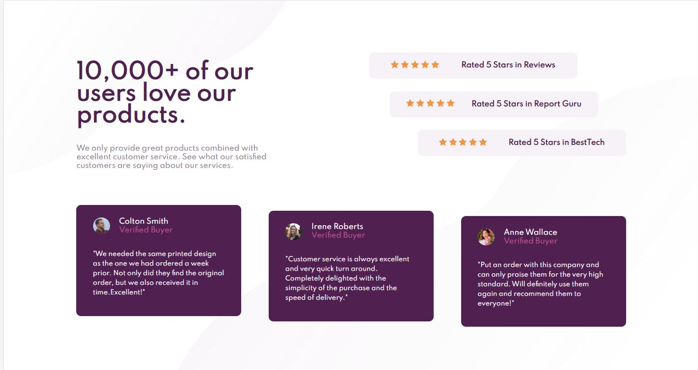

# Frontend Mentor - Social proof section solution

This is a solution to the [Social proof section challenge on Frontend Mentor](https://www.frontendmentor.io/challenges/social-proof-section-6e0qTv_bA). Frontend Mentor challenges help you improve your coding skills by building realistic projects. 

## Table of contents

- [Overview](#overview)
  - [The challenge](#the-challenge)
  - [Screenshot](#screenshot)
  - [Links](#links)
- [My process](#my-process)
  - [Built with](#built-with)
  - [Notes](#Notes)
- [Author](#author)

## Overview

### The challenge

Users should be able to:

- View the optimal layout for the section depending on their device's screen size

### Screenshot

### Links

- Solution URL: [Add solution URL here](https://your-solution-url.com)
- Live Site URL: [https://pechemelba.github.io/Social-Proof-section-master/](https://your-live-site-url.com)

## My process

### Built with

- HTML
- CSS
- Flexbox

### Notes

6th challenge from Frontend Mentor. Nothing special to say, I'm starting to feel more confortable with flexbox.

## Author

- Frontend Mentor - [@PecheMelba](https://www.frontendmentor.io/profile/PecheMelba)
